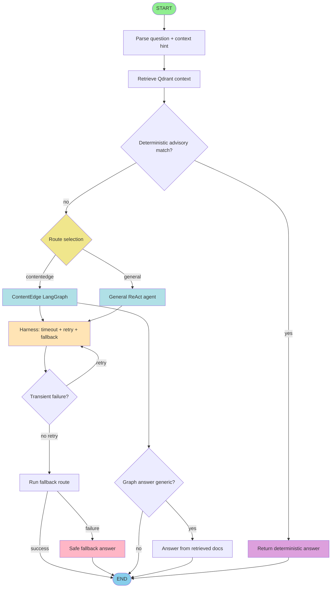

# Agent LangGraph Architecture (Current)

## Runtime Notes

- Context hints from SE Tools are injected into each turn.
- For MobiusRemoteCLI adelete requests with command template context, output should be an executable full command.
- Harness controls resiliency: timeout, retry on transient errors, and route fallback.
- Harness settings come from environment variables:
    - AGENT_HARNESS_TIMEOUT_SECONDS
    - AGENT_HARNESS_FALLBACK_TIMEOUT_SECONDS
    - AGENT_HARNESS_MAX_ATTEMPTS
    - AGENT_HARNESS_RETRY_BACKOFF_SECONDS

## Streaming Stages (`POST /ask/stream`)

The stream can emit status events including:

- received
- reset_history
- loading_history
- agent_processing
- routing_contentedge_langgraph / routing_general_react
- harness_attempt
- harness_retry
- harness_fallback_start
- harness_fallback_success
- harness_give_up
- saving_history
- finalizing
- answer
- done
