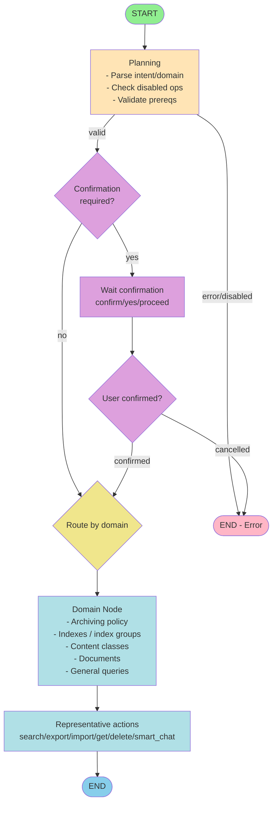

# Agent LangGraph Architecture

```mermaid
flowchart TB
    START([START])
    PLANNING["Planning<br/>- Parse intent/domain<br/>- Check disabled ops<br/>- Validate prereqs"]

    CONFIRMATION{"Confirmation<br/>required?"}
    CONFIRM_NODE["Wait confirmation<br/>confirm/yes/proceed"]
    USER_RESPONSE{"User confirmed?"}

    ROUTE_DECISION{"Route by domain"}
    DOMAIN_NODE["Domain Node<br/>- Archiving policy<br/>- Indexes / index groups<br/>- Content classes<br/>- Documents<br/>- General queries"]
    TOOL_ACTIONS["Representative actions<br/>search/export/import/get/delete/smart_chat"]

    END_SUCCESS([END])
    END_ERROR([END - Error])

    START --> PLANNING
    PLANNING -->|valid| CONFIRMATION
    PLANNING -->|error/disabled| END_ERROR

    CONFIRMATION -->|yes| CONFIRM_NODE
    CONFIRMATION -->|no| ROUTE_DECISION

    CONFIRM_NODE --> USER_RESPONSE
    USER_RESPONSE -->|confirmed| ROUTE_DECISION
    USER_RESPONSE -->|cancelled| END_ERROR

    ROUTE_DECISION --> DOMAIN_NODE
    DOMAIN_NODE --> TOOL_ACTIONS
    TOOL_ACTIONS --> END_SUCCESS

    style START fill:#90EE90
    style END_SUCCESS fill:#87CEEB
    style END_ERROR fill:#FFB6C6
    style PLANNING fill:#FFE4B5
    style CONFIRMATION fill:#DDA0DD
    style CONFIRM_NODE fill:#DDA0DD
    style USER_RESPONSE fill:#DDA0DD
    style ROUTE_DECISION fill:#F0E68C
    style DOMAIN_NODE fill:#B0E0E6
    style TOOL_ACTIONS fill:#B0E0E6
```
